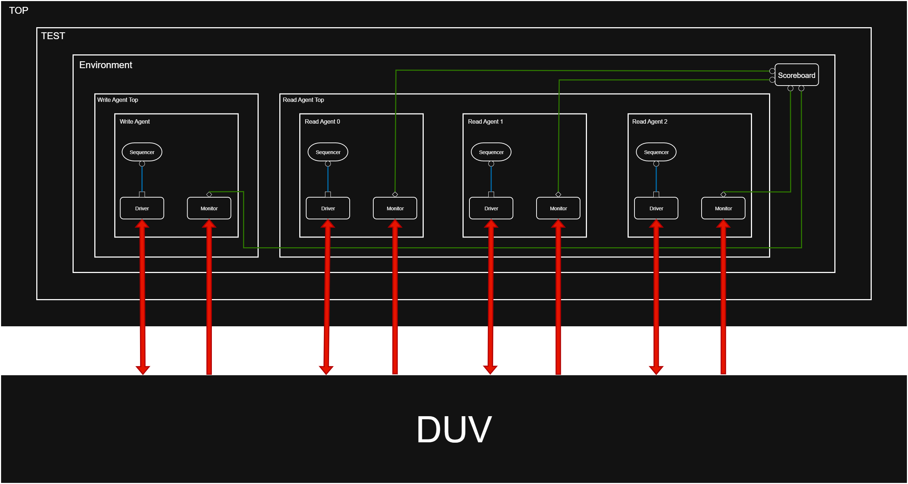

# 🚦 Router 1x3 – RTL + UVM Verification Project

This repository contains the **1x3 packet router RTL design** along with a complete **UVM-based verification environment**. The project demonstrates end-to-end flow: from RTL design and synthesis to functional verification with UVM testbench, assertions, and coverage.

------

## 🧠 Project Overview

- **Single Source → Three Destinations**: Only one packet is sent at a time from the source, but if available, all three destinations can read their respective data **simultaneously**.
- **Packet Format**: Header, Payload, and Parity.
- **Design Goal**: Implement modular Verilog RTL and verify its correctness using SystemVerilog UVM.

📌 Both **QuestaSim** and **Synopsys VCS** are supported for simulation.

------

## 🧱 Block-Level RTL Design

The RTL is structured into **6 modules**:

### 1️⃣ FSM Controller

- Central controller driving states based on inputs.
- Generates synchronization, register, and FIFO control signals.

### 2️⃣ Synchronizer

- Decodes header to determine destination FIFO.
- Generates **write enable** for FIFOs.
- Controls **valid_out** signals to destinations.
- Performs **soft reset** if FIFO data isn’t read in 30 cycles.

### 3️⃣ Register Block

- Holds header, parity, and intermediate states.
- Computes internal parity for error checking.

### 4️⃣ FIFO Buffers (x3)

- One FIFO per destination.
- Stores payload data and outputs on valid read.

### 5️⃣ Router Top

- Integrates FSM, Synchronizer, Register, and FIFOs.

📌 **Diagram:**


------

## 📦 Packet Structure

```
+-------------+-------------------+---------------+
| Header Byte | Payload (n Bytes) | Parity Byte   |
+-------------+-------------------+---------------+
```

- **Header Byte**:
  - Bits [7:2] → Payload length (max 64 bytes)
  - Bits [1:0] → Destination address
- **Payload**: Actual data bytes.
- **Parity**: Single-byte error detection.

------

## 🧪 UVM Testbench Architecture

The UVM testbench verifies functional correctness of the router using **agents, environment, scoreboard, and sequences**.

📌 **Diagram:**



### 🔹 Write Agent (`wr_agt_top/`)

- **Driver**: Drives input transactions (packet header, payload, parity).
- **Sequencer**: Controls transaction flow.
- **Monitor**: Observes packets sent into the DUT.
- **Config**: Provides configuration (is_active, virtual interface).

### 🔹 Read Agent (`rd_agt_top/`)

- **Driver**: Simulates destination reads from FIFOs.
- **Sequencer**: Handles read operations.
- **Monitor**: Captures output packets.
- **Config**: Destination-specific setup (is_active, virtual interface).

### 🔹 Environment (`tb/`)

- **`router_env.sv`**: Instantiates write + read agents.
- **`router_env_config.sv`**: Configures environment.
- **`router_sb.sv`**: Scoreboard compares expected vs. actual outputs.
- **`router_assertions.sv`**: Ensures protocol-level checks.

### 🔹 Sequences

- **Write Sequences** (`wr_sequence.sv`): Generate stimulus packets.
- **Read Sequences** (`rd_sequence.sv`): Read responses from DUT.
- **Virtual Sequence** (`v_sequence.sv`): Coordinates read & write agents.

### 🔹 Test Layer (`test/`)

- **`router_test_lib.sv`**: Collection of tests.
- Controls environment instantiation + sequence selection.

------

## 📁 Folder Structure

```
Router-1x3/
├── docs/              # Design & testbench diagrams
├── lint/              # Linting scripts and reports
├── rtl/               # RTL modules
├── sim/               # Simulation makefile
├── synth/             # Synthesis reports and netlist
├── tb/                # UVM environment files
├── rd_agt_top/        # Read agent
├── wr_agt_top/        # Write agent
├── test/              # UVM test library
└── README.md          # Project documentation
```

------

## ▶️ Simulation & Running Tests

### 🔹 Prerequisites

- **QuestaSim 2021.2+** or **Synopsys VCS-MX**
- **SystemVerilog + UVM (IEEE 1800.2-2020)**

### 🔹 Run Commands

Run from the `sim/` directory:

```bash
# Run individual tests
make sim1   # Example test 1
make sim2   # Example test 2

# Run full regression
make regress
```

- `sim1`, `sim2`, … correspond to different testcases in `router_test_lib.sv`.
- `make regress` executes all tests.

### 🔹 Outputs

- Simulation logs (`*.log`)
- Waveform dumps (`.vcd` / `.fsdb`)
- Coverage reports

------

## 📌 Tools Used

- **QuestaSim** – Functional simulation
- **Synopsys VCS** – Regression runs
- **SpyGlass Lint** – RTL linting
- **Synopsys Design Compiler** – Synthesis

------

## 🔍 Learning Outcomes

Through this project, you’ll learn:

- RTL modular design and FSM-based control.
- UVM agent, monitor, driver, sequencer, and env creation.
- Writing sequences and virtual sequences.
- Scoreboard-based checking and assertions.
- Simulation workflow with Makefile automation.

------

## 🙋‍♂️ Author

**Hithaishi S R**  
 🔗 [LinkedIn](https://linkedin.com/in/hithaishisr)